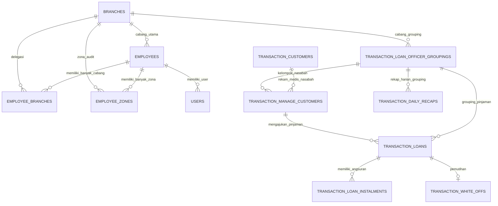

# Dokumentasi Alur Aplikasi (Flow, Permission/Role, & Input-Output Column Mapping) — `unit-apps`

Dokumen ini menyajikan analisis menyeluruh seluruh alur kerja (*flow*) aplikasi **`unit-apps`**, mencakup skema input-output, matriks permission dan role, alur penyaringan data terpusat (*Global Branch Scope*), serta pemetaan lengkap input form ke kolom tabel *database*.

---

## 1. Arsitektur Otorisasi & Scope Access (RBAC & Global Filter)

Aplikasi `unit-apps` mengintegrasikan sistem otorisasi **Spatie Roles & Permissions** dengan mekanisme penyaringan data cabang terpusat (**Global Branch Selector** via `AuthScope`).

### A. Matriks Otorisasi Berdasarkan Jabatan (*Employment & Role*)

| Role / Jabatan | Cabang Utama | Cabang Delegasi (`employee_branches`) | Zona Audit (`employee_zones`) | Akses Kelompok / Area | Izin Input (`can-create`) | Izin Edit (`can-edit`) | Izin Approve (`can-approve`) | Access Level |
| :--- | :---: | :---: | :---: | :---: | :---: | :---: | :---: | :--- |
| **Mantri** (`mantri`) | ✅ | ❌ | ❌ | Hanya Area Sendiri (`employee.area`) | ✅ | ❌ | ❌ | Field Officer / Mobile |
| **Kepala Mantri** (`kepala-mantri`) | ✅ | ❌ | ❌ | Hanya Area Sendiri (`employee.area`) | ✅ | ❌ | ✅ (Terbatas) | Field Supervisor |
| **Kasir** (`kasir`) | ✅ | ❌ | ❌ | Semua Kelompok (`view-all-groups`) | ✅ | ✅ | ✅ | Branch Administrator |
| **Pimpinan** (`pimpinan`) | ✅ | ✅ | ❌ | Semua Kelompok (`view-all-groups`) | ✅ | ✅ | ✅ | Branch Manager |
| **Pengawas** (`pengawas`) | ✅ | ✅ | ❌ | Semua Kelompok (`view-all-groups`) | ❌ | ❌ | ✅ | Regional Auditor |
| **Staf Kontrol** (`staf-kontrol`) | — | — | ✅ | Semua Kelompok (`view-all-groups`) | ❌ | ❌ | ❌ | Central Inspector |
| **Superuser** (`superuser`) | — | — | Semua Cabang | Semua Kelompok (`view-all-groups`) | ✅ | ✅ | ✅ | System Admin |

---

### B. 8 Permission Inti & Fungsinya

1. `view-all-branches`: Mengakses seluruh data cabang di sistem tanpa batasan (Superuser, Staf Kontrol).
2. `view-delegated-branches`: Mengakses cabang utama ditambah cabang-cabang delegasi pada pivot `employee_branches` (Pimpinan, Pengawas).
3. `view-zone-branches`: Mengakses cabang-cabang yang berada di wilayah audit pivot `employee_zones` (Staf Kontrol).
4. `view-all-groups`: Hak memilih dan melihat seluruh kelompok/resort dalam cabang terpilih. Jika tidak memiliki permission ini, data dipaksa (*hardcoded*) terkunci pada area karyawan (`employee.area`).
5. `can-create`: Hak membuat/menginput pengajuan pinjaman, angsuran, dan pembukuan harian.
6. `can-edit`: Hak memperbarui/mengedit data transaksi pinjaman, angsuran, dan manpower.
7. `can-approve`: Hak melakukan persetujuan (ACC/Tolak pengajuan pinjaman & Ceklist Approval Laporan Kasir). Mantri tidak diperbolehkan melakukan aksi ini.
8. `maintenance-worker`: Hak akses khusus teknis untuk override batasan tanggal edit/hapus data lampau (*backdate protection*).

---

## 2. Alur Utama Penyaringan Data (*Global Branch Scope Flow*)

Setiap permintaan (*request*) transaksi disaring secara terpusat melalui `AuthScope::resolve()`.

```mermaid
flowchart TD
    A[User Mengakses Halaman / Request API] --> B{Memiliki Permission view-all-branches?}
    B -- Ya --> C[Allowed Branches: NULL / Semua Cabang]
    B -- Tidak --> D{Memiliki Permission view-zone-branches?}
    D -- Ya --> E[Allowed Branches: Ambil dari employee_zones]
    D -- Tidak --> F[Allowed Branches: branch_id Utama + Pivot employee_branches]
    
    C --> G[Cek Session active_branch_id]
    E --> G
    F --> G
    
    G --> H{Apakah active_branch_id Valid?}
    H -- Ya --> I[Set Active Branch ID]
    H -- Tidak --> J[Fallback ke Branch Default via Branch::getDefaultBranchId]
    
    I --> K{Memiliki Permission view-all-groups?}
    J --> K
    
    K -- Ya --> L[Filter Kelompok = request('kelompok') atau Default 1]
    K -- Tidak --> M[Filter Kelompok = Terkunci ke employee.area]
    
    L --> N[Object AuthScope Ready: branch_id, wilayah, kelompok]
    M --> N
```

- **Route Active Branch**: `POST /set-branch` (`SetBranchController`)
- **Input**: `branch_id`
- **Output**: Memperbarui Session `active_branch_id` dan melakukan reload halaman.

---

## 3. Analisa Detail Flow Aplikasi per Modul

---

### Modul A: Pengajuan & Pencairan Pinjaman (*Loan Transactions*)

Mengelola pendaftaran nasabah baru/lama, pengajuan plafond pinjaman, persetujuan (ACC/Tolak), dan pencairan dana (*drop*).

#### 1. Flow Cek / Generate NIK Nasabah
- **Route**: `POST /bukutransaksi/nik` (`TransactionLoanController@nasabah_buku_transaksi`)
- **Role & Permission**: `can-create` (Mantri, KM, Kasir, Pimpinan, Superuser)
- **Input Payload**:
  - `nik` (String): NIK KTP atau kode awalan "UB"/"ML" untuk nasabah tanpa KTP.
- **Proses Logic**:
  - Jika awalan NIK "UB" atau "ML", `AppHelper::callUnknownNik()` memanggil `generateUnknownNik()` untuk membuat 16 digit NIK unik berbasis timestamp (`branch_id + kelompok_id + drop_date + random_number`).
  - Mengambil data nasabah & riwayat pinjaman dari database.
- **Output**: JSON Detail Data Nasabah & Status Pinjaman Terakhir.
- **Mapping Input ke Kolom DB**:
  - READ `transaction_customers`.`nik`

---

#### 2. Flow Input Pengajuan Pinjaman Baru
- **Route**: `POST /bukutransaksi` (`TransactionLoanController@store_buku_transaksi`)
- **Role & Permission**: `can-create`
- **Input Form (Payload)**:

| Field Input Form | Tipe Data | Keterangan | Kolom Target Database & Tabel |
| :--- | :--- | :--- | :--- |
| `nik` | String (16) | NIK KTP / Auto Generated NIK | `transaction_customers.nik` |
| `nama_nasabah` | String | Nama Lengkap Nasabah | `transaction_customers.nama` |
| `alamat` | Text | Alamat KTP/Domisili | `transaction_customers.alamat` |
| `no_kk` | String (16) | Nomor Kartu Keluarga | `transaction_customers.no_kk` |
| `nomor_telepon` | String | Nomor HP/WA | `transaction_manage_customers.alternative_name` / Notes |
| `pekerjaan` | String | Pekerjaan Nasabah | `transaction_manage_customers.notes` |
| `status_tempat_tinggal` | String | Milik Sendiri / Sewa / Orang Tua | `transaction_manage_customers.residential_address` |
| `kelompok` | Integer | Nomor Resort/Area | `transaction_loan_officer_groupings.kelompok` |
| `storting_day` | String | Hari Tagihan (senin - sabtu) | `transaction_manage_customers.day` |
| `drop_date` | Date | Tanggal Rencana Drop | `transaction_loans.drop_date` & `request_date` |
| `drop_amount` / `pinjaman`| Numeric | Nominal Plafond Pinjaman | `transaction_loans.request_nominal` & `pinjaman` |
| `mantri_id` | Integer | ID Employee Mantri Pengampu | `transaction_loans.user_mantri` |
| `pinjaman_ke` | Integer | Urutan Keberapa Pinjaman Ini | `transaction_loans.pinjaman_ke` |

- **Proses & Triggers**:
  1. `TransactionCustomer` dibuat atau di-update berdasarkan NIK.
  2. `TransactionLoanOfficerGrouping` dipastikan ada untuk kombinasi `branch_id` + `kelompok`.
  3. `TransactionManageCustomer` di-link antara Customer & Grouping.
  4. `TransactionLoan` dibuat dengan `status = 'pengajuan'`.
- **Output**: Flash Message Success, Redirect ke Halaman Buku Transaksi.

---

#### 3. Flow ACC / Approval & Pencairan (*Drop*) Pinjaman
- **Route**: `PUT /bukutransaksi/action/{transactionLoan}` (`TransactionLoanController@action_buku_transaksi`)
- **Role & Permission**: `can-approve` (**Mantri Dilarang**, hanya Kasir, Pimpinan, KM, Superuser)
- **Input Payload**:

| Field Input Form | Value Options | Kolom Target Database & Tabel |
| :--- | :--- | :--- |
| `action` | `'acc'`, `'drop'`, `'tolak'`, `'batal'` | `transaction_loans.status` |
| `approved_nominal` | Numeric | `transaction_loans.approved_nominal` & `nominal_drop` |
| `acc_note` / `notes` | Text | `transaction_loans.notes` |
| `drop_date` | Date | `transaction_loans.drop_date` |

- **Proses & Logic Execution**:
  - Ketika `status` di-update menjadi `'success'` (Drop Selesai), Model Event `TransactionLoan::booting()` memicu penambahan nominal pada `transaction_daily_recaps.drop` untuk tanggal `drop_date` terkait secara atomik.
  - `check_date` diisi tanggal saat ini, `user_check` diisi ID User yang men-approve.
- **Output**: Status Pinjaman berubah menjadi `'acc'` atau `'success'`. Rekap harian kasir ter-update otomatis.

---

#### 4. Flow Batch Input Pengajuan Pinjaman
- **Route**: `POST /bukutransaksi/batch` (`TransactionLoanController@store_buku_transaksi_batch`)
- **Role & Permission**: `can-create` / `role:kasir|pimpinan|kepala-mantri|superuser`
- **Input Payload**: Array of JSON Objects (Struktur input sama dengan Point 2 untuk eksekusi massal).

---

### Modul B: Pembayaran Angsuran & Pelunasan (*Instalments & Repayment*)

Mengelola pencatatan angsuran harian (*storting*), pembatalan angsuran, pelunasan pinjaman, dan pemutihan piutang macet.

#### 1. Flow Input Pembayaran Angsuran Harian (*Storting*)
- **Route**: `POST /pinjaman/actionloan/{transactionLoan}` (`TransactionLoanController@bayar_pinjaman`)
- **Role & Permission**: `can-create` (Diuji batasan tanggal lalu via `AppHelper::havePermissionByDate`)
- **Input Form (Payload)**:

| Field Input Form | Tipe Data | Keterangan | Kolom Target Database & Tabel |
| :--- | :--- | :--- | :--- |
| `transaction_loan_id` | Integer | ID Reference Pinjaman | `transaction_loan_instalments.transaction_loan_id` |
| `transaction_date` | Date | Tanggal Setoran / Bayar | `transaction_loan_instalments.transaction_date` |
| `nominal` | Numeric | Jumlah Uang Angsuran | `transaction_loan_instalments.nominal` |
| `danatitipan` | Numeric | Nominal Dana Titipan (jika ada) | `transaction_loan_instalments.danatitipan` |
| `instalment_notes` | Text | Catatan Khusus Angsuran | `transaction_loan_instalments.instalment_notes` |
| `user_mantri` | Integer | ID Mantri Penagih | `transaction_loan_instalments.user_mantri` |

- **Proses & Triggers Atomik**:
  1. Record baru disimpan pada `transaction_loan_instalments`.
  2. Model Event `TransactionLoanInstalment::booting()` berjalan otomatis dalam Database Transaction:
     - Meng-increment nilai `storting` pada `transaction_daily_recaps` untuk tanggal & grouping terkait.
     - Menghitung akumulasi angsuran (`SUM(nominal)`).
     - Memperbarui `transaction_loans.total_angsuran`.
     - **Pengecekan Pelunasan**: Jika `total_angsuran >= pinjaman`, sistem otomatis mengisi `transaction_loans.out_status = 'LUNAS'` dan `transaction_loans.out_date = transaction_date`.
- **Output**: Pembayaran tercatat, sisa saldo pinjaman berkurang.

---

#### 2. Flow Hapus / Revoke Angsuran
- **Route**: `DELETE /pinjaman/actionloan/{transactionLoanInstalment}` (`TransactionLoanController@destroy_angsuran`)
- **Role & Permission**: `can-edit` / `can-approve` (+ Validation `AppHelper::havePermissionByDate`)
- **Input Payload**: `transactionLoanInstalment` ID (via URL parameter).
- **Proses & Logic Execution**:
  - Model Event `deleting` mengurangi `total_angsuran` pada parent `transaction_loans`.
  - Mengurangi nominal `storting` pada `transaction_daily_recaps`.
  - Jika sebelumnya status `'LUNAS'`, `out_status` dan `out_date` dikembalikan menjadi `NULL`.
- **Output**: Data angsuran terhapus & pembukuan sirkulasi pulih.

---

#### 3. Flow Pemutihan Pinjaman Macet (*White-Off*)
- **Route**: `POST /pinjaman/white-off-loan/{transactionLoan}` (`TransactionLoanController@white_off_loan`)
- **Role & Permission**: `can-approve` (Pimpinan, Superuser)
- **Input Form (Payload)**:

| Field Input Form | Tipe Data | Kolom Target Database & Tabel |
| :--- | :--- | :--- |
| `transaction_loan_id` | Integer | `transaction_white_offs.transaction_loan_id` |
| `date` | Date | `transaction_white_offs.date` |
| `amount` | Numeric | `transaction_white_offs.amount` |
| `reason` | Text | `transaction_white_offs.reason` |

- **Efek Pembukuan**:
  - Inserts ke `transaction_white_offs`.
  - `transaction_loans.status` diubah ke `'white_off'`, `out_status` diubah ke `'PEMUTIHAN'`, `out_date` diisi `date`.
- **Output**: Pinjaman tidak lagi ditagih / keluar dari saldo aktif.

---

### Modul C: Entry Massal Pembukuan Harian (*Batch Input*)

Digunakan oleh Kasir atau Mantri untuk memasukkan data transaksi harian kolektif per resort.

#### 1. Flow Validasi & Store Batch Input
- **Route Check**: `POST /batch-input/check` (`BatchInputController@validateData`)
- **Route Store**: `POST /batch-input` (`BatchInputController@store`)
- **Role & Permission**: `can-create` (Kasir, Pimpinan, Superuser)
- **Input Payload**: JSON Array Matriks Harian (Pinjaman Baru + Angsuran Harian per Kelompok).
- **Proses**:
  - `validateData()` mengecek keabsahan NIK dan kelengkapan saldo.
  - `store()` melakukan bulk-insert ke `transaction_loans` dan `transaction_loan_instalments` serta memperbarui `transaction_daily_recaps`.
- **Output**: Rekapitulasi transaksi harian terbentuk sekaligus.

---

### Modul D: Rekap Harian Kasir & Operational Cash (*Daily Recaps*)

Mengatur sirkulasi uang kas harian cabang, kasbon, operasional, dan persetujuan pimpinan.

#### 1. Flow Update Laporan Harian Kasir
- **Route**: `POST /kasir/rekap` (`TransactionDailyRecapController@rekap_post`)
- **Role & Permission**: `can-create` / `kasir` / `pimpinan`
- **Input Form (Payload)**:

| Field Input Form | Tipe Data | Keterangan | Kolom Target Database & Tabel |
| :--- | :--- | :--- | :--- |
| `date` | Date | Tanggal Pembukuan | `transaction_daily_recaps.date` |
| `kasbon` | Numeric | Kasbon Karyawan/Mantri | `transaction_daily_recaps.kasbon` |
| `sharingdo` | Numeric | Dana Sharing Dropping | `transaction_daily_recaps.sharingdo` |
| `titipan` | Numeric | Dana Titipan Masuk | `transaction_daily_recaps.titipan` |
| `debt` | Numeric | Titipan/Hutang | `transaction_daily_recaps.debt` |
| `transport` | Numeric | Biaya Transportasi | `transaction_daily_recaps.transport` |
| `kred` | Numeric | Pengeluaran Kreditor | `transaction_daily_recaps.kred` |
| `tunai` | Numeric | Sisa Cash Tunai di Brankas | `transaction_daily_recaps.tunai` |
| `masuk` | Numeric | Total Cash Masuk | `transaction_daily_recaps.masuk` |
| `keluar` | Numeric | Total Cash Keluar | `transaction_daily_recaps.keluar` |

- **Proses & Logic**:
  - Menghitung ulang target sirkulasi harian: `target = target_lama + (drop * 0.13) - keluar`.
- **Output**: Laporan Kasir Terpenuhi.

---

#### 2. Flow Approval Ceklist Laporan Kasir oleh Pimpinan
- **Route**: `POST /kasir/rekap/ceklist-kepala` (`TransactionDailyRecapController@ceklist_kepala`)
- **Role & Permission**: `can-approve` (Pimpinan, Kepala Mantri)
- **Input Payload**:

| Field Input Form | Tipe Data | Kolom Target Database & Tabel |
| :--- | :--- | :--- |
| `daily_recap_id` | Integer | `transaction_daily_recaps.id` |
| `daily_kepala_approval` | Boolean | `transaction_daily_recaps.daily_kepala_approval` |

- **Output**: Laporan Kasir Terkunci & Disetujui Pimpinan (`daily_kepala_approval_user` terisi ID Pimpinan).

---

### Modul E: Administrasi Karyawan (*Manpower Management*)

Mengelola data SDM Karyawan dan pembuatan akun sistem.

#### 1. Flow Tambah / Edit Karyawan
- **Route**: `POST /administrasi/manpower` (`EmployeeController@store`)
- **Role & Permission**: `pimpinan` / `superuser` / `view-all-branches`
- **Input Form (Payload)**:

| Field Input Form | Tipe Data | Keterangan | Kolom Target Database & Tabel |
| :--- | :--- | :--- | :--- |
| `name` | String | Nama Karyawan | `employees.name` & `users.name` |
| `nik` | String | NIK Karyawan | `employees.nik` |
| `employment_id` | Integer | ID Jabatan Master | `employees.employment_id` |
| `branch_id` | Integer | Cabang Utama | `employees.branch_id` |
| `area` | Integer | Kelompok/Resort | `employees.area` |
| `phone` | String | No HP/WA | `employees.phone` |
| `date_in` | Date | Tanggal Masuk Kerja | `employees.date_in` |

- **Proses**:
  - Menambah record di tabel `employees`.
  - Membuat akun `users` baru (Username auto-generated, default password) dan mengikat `user.employee_id = employee.id`.
  - Melakukan Assign Role Spatie sesuai `employment_id`.
- **Output**: Karyawan & User terdaftar.

---

### Modul F: Panel Admin & Multi-Cabang / Multi-Zona RBAC

Mengatur penugasan role, permission, serta pivot multi-cabang/multi-zona untuk karyawan.

#### 1. Flow Assign Role & Permission User
- **Route**: `POST /admin-panel/role-assign` (`AdminController@role_assign`)
- **Role & Permission**: `superuser`
- **Input Payload**: `user_id` (Integer), `roles` (Array of Strings).
- **Database Target**: Tabel Spatie `model_has_roles`.

---

#### 2. Flow Assign Multi-Cabang Delegasi & Multi-Zona Audit
- **Route**: `POST /admin-panel/user-assign` (`AdminController@user_assign`)
- **Role & Permission**: `superuser`
- **Input Form (Payload)**:

| Field Input Form | Tipe Data | Kolom Target Database & Tabel |
| :--- | :--- | :--- |
| `user_id` / `employee_id` | Integer | `employee_branches.employee_id` & `employee_zones.employee_id` |
| `branches` | Array of Integers | `employee_branches.branch_id` |
| `zones` | Array of Integers | `employee_zones.branch_id` & `wilayah` |
| `permissions` | Array of Strings | Spatie `model_has_permissions` |

- **Efek Sistem**:
  - Pimpinan/Pengawas yang didaftarkan di `employee_branches` secara otomatis dapat memilih cabang-cabang tersebut via Global Selector.
  - Staf Kontrol yang didaftarkan di `employee_zones` secara otomatis mendapatkan hak audit wilayah tersebut.

---

#### 3. Flow Toggle Maintenance Worker Override
- **Route**: `POST /admin-panel/giveMaintenerWorker` (`AdminController@giveMaintenerWorker`)
- **Role & Permission**: `superuser`
- **Input Payload**: `user_id` (Integer), `grant_status` (Boolean).
- **Hasil**: Menambahkan/mencabut permission `maintenance-worker` sehingga user bisa melakukan pembetulan data lampau yang terkunci.

---

## 4. Diagram Arsitektur Relasi Data & Otorisasi Transaksi



---

## 5. Ringkasan Pemetaan Seluruh Tabel Database Inti

| Nama Tabel Database | Fungsi Utama | Key Foreign Keys | Kolom Input Kunci |
| :--- | :--- | :--- | :--- |
| `branches` | Master Data Cabang | `wilayah` | `name`, `code`, `wilayah` |
| `employees` | Master Data Karyawan | `branch_id`, `employment_id` | `name`, `nik`, `area`, `phone`, `date_in`, `date_resign` |
| `users` | Akun Login System | `employee_id` | `name`, `username`, `email`, `password` |
| `employee_branches` | Pivot Delegasi Multi-Cabang | `employee_id`, `branch_id` | `employee_id`, `branch_id` |
| `employee_zones` | Pivot Multi-Zona Staf Kontrol | `employee_id`, `branch_id` | `employee_id`, `branch_id`, `wilayah` |
| `transaction_customers` | Master Biodata Nasabah | — | `nik`, `nama`, `no_kk`, `alamat` |
| `transaction_loan_officer_groupings` | Pivot Cabang & Kelompok/Resort | `branch_id` | `branch_id`, `kelompok` |
| `transaction_manage_customers` | Link Nasabah ke Kelompok & Hari | `transaction_customer_id`, `transaction_loan_officer_grouping_id` | `day`, `residential_address`, `alternative_name`, `status` |
| `transaction_loans` | Header Transaksi Pinjaman | `transaction_manage_customer_id`, `transaction_loan_officer_grouping_id`, `user_mantri`, `user_input` | `request_date`, `drop_date`, `request_nominal`, `approved_nominal`, `nominal_drop`, `pinjaman`, `status`, `out_status`, `out_date`, `pinjaman_ke` |
| `transaction_loan_instalments` | Detail Pembayaran Angsuran | `transaction_loan_id`, `transaction_loan_officer_grouping_id`, `user_mantri`, `user_input` | `transaction_date`, `nominal`, `status`, `danatitipan`, `instalment_notes` |
| `transaction_daily_recaps` | Laporan Rekap Harian Kasir | `transaction_loan_officer_grouping_id` | `date`, `drop`, `storting`, `kasbon`, `sharingdo`, `titipan`, `debt`, `transport`, `kred`, `tunai`, `masuk`, `keluar`, `daily_kepala_approval` |
| `transaction_white_offs` | Catatan Pemutihan Piutang | `transaction_loan_id`, `user_id`, `branch_id` | `date`, `amount`, `reason` |

---

*Dokumen ini disusun sebagai acuan standar analisis flow sistem, otorisasi, dan struktur data proyek `unit-apps`.*
